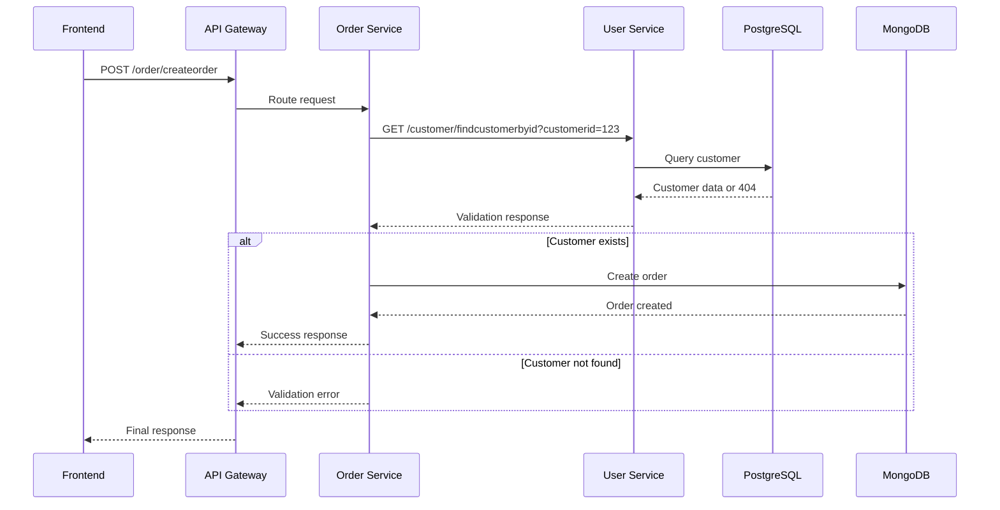

# Microservices Project

Este proyecto implementa una arquitectura de microservicios moderna y escalable, diseñada para demostrar las mejores prácticas en el desarrollo de sistemas distribuidos. La arquitectura está construida con tecnologías de vanguardia y sigue los principios de microservicios, incluyendo service discovery automático, API Gateway centralizado y bases de datos especializadas.

## 🏗️ Arquitectura del Sistema

### Microservicios

El sistema está compuesto por tres microservicios principales, cada uno implementado con tecnologías específicas que aprovechan las fortalezas de cada stack:

- **Login Service**: Implementado en **Go** con el framework **Gin**, utiliza **Redis** como base de datos en memoria para el almacenamiento rápido de sesiones y tokens de autenticación. Este servicio maneja la autenticación y autorización de usuarios.

- **User Service**: Desarrollado en **Python** usando **FastAPI** para su excelente rendimiento y documentación automática, se conecta a **PostgreSQL** para el almacenamiento persistente de datos de usuarios con integridad referencial.

- **Order Service**: Construido con **Node.js** y **Express.js**, utiliza **MongoDB** como base de datos NoSQL para manejar la flexibilidad requerida en el manejo de órdenes y su evolución.

- **Frontend**: Aplicación **Angular** servida a través de **Nginx**, proporcionando una interfaz de usuario moderna y responsiva.

### Infraestructura de Soporte

La infraestructura está diseñada para proporcionar alta disponibilidad, escalabilidad y observabilidad:

- **Service Discovery**: **Consul** actúa como el sistema de descubrimiento de servicios, permitiendo que los microservicios se registren automáticamente y sean descubiertos dinámicamente por otros componentes del sistema.

- **API Gateway**: **Traefik** funciona como el punto de entrada único para todas las peticiones, proporcionando enrutamiento inteligente, balanceamiento de carga, y middlewares de seguridad y CORS.

## 🚀 Inicio Rápido

### Prerrequisitos del Sistema

Antes de comenzar, asegúrate de tener instalado en tu sistema:

- **Docker** (versión 20.10 o superior)
- **Docker Compose** (versión 2.0 o superior)
- **Git** (para clonar el repositorio)
- **Puertos disponibles**: 80, 443, 8080, 8081, 8500, 5432, 6379, 27017

### Configuración del Proyecto

#### 1. Clonar el Repositorio

```bash
git clone <repository-url>
cd Project-Software-Engineering
```

#### 2. Configurar Variables de Entorno

El proyecto utiliza un archivo `.env` para gestionar las configuraciones sensibles y específicas del entorno. Este enfoque permite una fácil configuración entre diferentes ambientes (desarrollo, testing, producción).

```bash
# Copiar el archivo de ejemplo
cp env.example .env

# Editar las variables según tu entorno
nano .env  # o tu editor preferido
```

**¿Por qué usar .env?**

- **Seguridad**: Mantiene las credenciales fuera del código fuente
- **Flexibilidad**: Permite diferentes configuraciones por entorno
- **Simplicidad**: Un solo archivo para todas las configuraciones
- **Docker Integration**: Docker Compose lee automáticamente las variables del archivo .env

#### 3. Levantar la Infraestructura Completa

```bash
# Levantar todos los servicios en modo detached
docker-compose up -d

# Verificar que todos los servicios estén ejecutándose
docker-compose ps
```

> 🎯 **Configuración Automática**: El sistema se configura automáticamente al iniciar:
> - Las tablas de PostgreSQL se crean automáticamente en el primer inicio
> - Los servicios se registran automáticamente en Consul para service discovery
> - Traefik configura las rutas dinámicamente basado en los servicios disponibles

#### 4. Verificar el Estado de los Servicios

```bash
# Ver el estado de todos los contenedores
docker-compose ps

# Ver logs en tiempo real si hay problemas
docker-compose logs -f

# Ver logs de un servicio específico
docker-compose logs -f login-service
```

> 📋 **Nota**: Los servicios pueden tardar unos minutos en estar completamente disponibles debido a los health checks y la inicialización de las bases de datos.

## 🔄 Comunicación Inter-Servicios

Este proyecto implementa **comunicación real entre microservicios** usando Consul para service discovery y HTTP para las llamadas entre servicios.

### Ejemplo de Flujo Inter-Servicios

Cuando se crea una nueva orden, el sistema ejecuta el siguiente flujo:



### Características de la Comunicación

- **Service Discovery**: Los servicios se descubren automáticamente usando Consul
- **Validación de Datos**: Order-service valida que los customers existan antes de crear órdenes
- **Tolerancia a Fallos**: Los servicios manejan errores de comunicación gracefully
- **Logging Distribuido**: Cada llamada inter-servicio se registra para debugging

### Endpoints de Comunicación Interna

| Servicio Origen | Servicio Destino | Endpoint | Propósito |
|----------------|------------------|----------|-----------|
| Order Service  | User Service     | `/customer/findcustomerbyid` | Validar customer antes de crear orden |
| Order Service  | User Service     | `/customer/preferences` | Obtener preferencias del usuario |
| Login Service  | User Service     | `/customer/authenticate` | Validar credenciales |

## 📊 Servicios y Puertos

### Microservicios y APIs

| Servicio          | Puerto | Descripción                                  | Acceso Directo           |
| ----------------- | ------ | -------------------------------------------- | ------------------------ |
| **API Gateway**   | 8090   | Punto de entrada único (Traefik)             | <http://localhost:8090/> |
| **Login Service** | 8081   | Servicio de autenticación (Go + Gin + Redis) | <http://localhost:8081/> |
| **User Service**  | 8000   | Servicio de usuarios (Python + FastAPI)      | <http://localhost:8000/> |
| **Order Service** | 3000   | Servicio de órdenes (Node.js + Express)      | <http://localhost:3000/> |
| **Frontend**      | 4200   | Aplicación Angular (Nginx)                   | <http://localhost:4200/> |

### Infraestructura y Dashboards

| Servicio              | Puerto | Descripción                      | URL de Acceso            |
| --------------------- | ------ | -------------------------------- | ------------------------ |
| **Traefik Dashboard** | 8080   | Panel de control del API Gateway | <http://localhost:8080/> |
| **Consul UI**         | 8500   | Interfaz de Service Discovery    | <http://localhost:8500/> |

### Rutas a través del API Gateway

**⚠️ IMPORTANTE**: Todas las peticiones a los microservicios deben realizarse a través del API Gateway en el puerto 8090. No acceder directamente a los puertos de los servicios.

| API | URL de Acceso | Descripción |
|-----|---------------|-------------|
| **Login API** | `http://localhost:8090/login/*` | Autenticación y gestión de sesiones |
| **Customer API** | `http://localhost:8090/customer/*` | Gestión de clientes y usuarios |
| **Order API** | `http://localhost:8090/order/*` | Gestión de órdenes y pedidos |

#### Ejemplos de Uso del API Gateway

```bash
# Crear un customer
curl -X POST "http://localhost:8090/customer/createcustomer" \
  -H "Content-Type: application/json" \
  -d '{
    "document": "12345678",
    "firstname": "Juan",
    "lastname": "Pérez",
    "email": "juan@example.com",
    "address": "Calle 123",
    "phone": "555-0123"
  }'

# Crear una orden (valida automáticamente que el customer exista)
curl -X POST "http://localhost:8090/order/createorder" \
  -H "Content-Type: application/json" \
  -d '{
    "customerID": "12345678",
    "products": [{"name": "Product 1", "quantity": 2, "price": 25.99}],
    "status": "Received"
  }'
```

## 🗄️ Bases de Datos

El proyecto utiliza tres tipos diferentes de bases de datos, cada una optimizada para el tipo de datos que maneja:

| Base de Datos  | Puerto | Servicio      | Propósito                                         |
| -------------- | ------ | ------------- | ------------------------------------------------- |
| **Redis**      | 6379   | Login Service | Almacenamiento en memoria para sesiones y tokens  |
| **PostgreSQL** | 5432   | User Service  | Base de datos relacional para datos estructurados |
| **MongoDB**    | 27017  | Order Service | Base de datos NoSQL para datos flexibles          |

### Características de las Bases de Datos

- **Redis**: Proporciona acceso ultra-rápido a datos de sesión y cache, ideal para autenticación
- **PostgreSQL**: Garantiza integridad referencial y transacciones ACID para datos de usuarios
- **MongoDB**: Permite esquemas flexibles y escalabilidad horizontal para órdenes complejas

## 🔧 Gestión de Servicios

### Levantar Servicios por Módulos

El proyecto está organizado en módulos Docker Compose separados para facilitar el desarrollo y testing:

```bash
# Solo bases de datos (Redis, PostgreSQL, MongoDB)
docker-compose -f docker-compose.databases.yml up -d

# Solo infraestructura (Consul, Traefik)
docker-compose -f docker-compose.infrastructure.yml up -d

# Solo microservicios (Login, User, Order)
docker-compose -f docker-compose.services.yml up -d

# Solo frontend (Angular + Nginx)
docker-compose -f docker-compose.frontend.yml up -d
```

### Monitoreo y Logs

```bash
# Ver logs de todos los servicios en tiempo real
docker-compose logs -f

# Ver logs de un servicio específico
docker-compose logs -f login-service
docker-compose logs -f traefik
docker-compose logs -f consul

# Ver logs con timestamps
docker-compose logs -f -t
```

### Gestión del Ciclo de Vida

```bash
# Reiniciar un servicio específico
docker-compose restart login-service

# Reconstruir y reiniciar (útil durante desarrollo)
docker-compose up -d --build login-service

# Parar todos los servicios
docker-compose down

# Parar y eliminar volúmenes (¡CUIDADO: elimina datos!)
docker-compose down -v

# Limpieza completa (elimina contenedores, volúmenes e imágenes)
docker-compose down -v --rmi all
```

## 🏥 Health Checks y Monitoreo

### Verificación del Estado de los Servicios

Todos los servicios incluyen health checks automáticos que verifican su disponibilidad:

```bash
# Estado de todos los servicios
docker-compose ps

# Health checks específicos a través del API Gateway
curl http://localhost:8090/login/health     # Login Service
curl http://localhost:8090/customer/health  # User Service
curl http://localhost:8090/order/health     # Order Service

# Health checks directos (para debugging)
curl http://localhost:8081/health      # Login Service directo
curl http://localhost:8000/health      # User Service directo
curl http://localhost:3000/health      # Order Service directo
```

### Dashboards de Monitoreo

#### Traefik Dashboard

- **URL**: <http://localhost:8080>
- **Propósito**: Monitorear el tráfico, rutas y estado de los servicios
- **Características**:
  - Visualización de servicios registrados
  - Métricas de tráfico en tiempo real
  - Estado de health checks
  - Configuración de middlewares

#### Consul UI

- **URL**: <http://localhost:8500>
- **Propósito**: Gestionar el service discovery y la configuración
- **Características**:
  - Lista de servicios registrados
  - Estado de salud de los servicios
  - Configuración de key-value store
  - Visualización de nodos del cluster

## 🛠️ Desarrollo y Configuración

### Estructura del Proyecto

El proyecto está organizado siguiendo las mejores prácticas de microservicios con una estructura modular y escalable:

```
Project-Software-Engineering/
├── consul/                    # Configuración de Consul
│   └── consul.json           # Configuración del cluster Consul
├── traefik/                  # Configuración de Traefik
│   ├── traefik.yml           # Configuración principal del API Gateway
│   └── dynamic.yml           # Configuración dinámica de rutas y middlewares
├── postgres/                 # Scripts de inicialización de PostgreSQL
│   └── init.sql              # Script de creación de tablas
├── mongodb/                  # Scripts de inicialización de MongoDB
│   └── init-mongo.js         # Script de creación de colecciones
├── frontend/                 # Aplicación Angular
│   ├── Dockerfile            # Imagen del frontend
│   └── nginx.conf            # Configuración de Nginx
├── login-service/            # Servicio de autenticación (Go + Gin + Redis)
│   ├── internal/             # Código interno del servicio
│   ├── pkg/                  # Paquetes compartidos
│   ├── api/                  # Documentación OpenAPI
│   ├── Dockerfile            # Imagen del servicio
│   └── go.mod                # Dependencias Go
├── user-service/             # Servicio de usuarios (Python + FastAPI + PostgreSQL)
├── order-service/            # Servicio de órdenes (Node.js + Express + MongoDB)
├── docker-compose.yml        # Orquestación principal
├── docker-compose.*.yml      # Archivos de composición modulares
├── env.example               # Plantilla de variables de entorno
└── README.md                 # Documentación del proyecto
```


### Configuración de Infraestructura

#### Consul (Service Discovery)

La carpeta `consul/` contiene la configuración del cluster de Consul:

- **`consul.json`**: Define la configuración del servidor Consul, incluyendo puertos, configuración de red y opciones de clustering
- **Propósito**: Permite el registro automático de servicios y su descubrimiento dinámico

#### Traefik (API Gateway)

La carpeta `traefik/` contiene toda la configuración del API Gateway:

- **`traefik.yml`**: Configuración principal que define providers (Consul, archivos), entrypoints y logging
- **`dynamic.yml`**: Configuración dinámica que define rutas, middlewares (CORS, rate limiting, security headers) y servicios
- **Propósito**: Centraliza el enrutamiento, balanceamiento de carga y aplica middlewares de seguridad

### Gestión de Variables de Entorno

El archivo `.env` es fundamental para la configuración del proyecto:

```bash
# Ejemplo de variables importantes
REDIS_PASSWORD=redis_password_123
POSTGRES_PASSWORD=postgres_password_123
MONGO_ROOT_PASSWORD=mongo_password_123
```

**Ventajas del enfoque .env:**

- **Configuración centralizada**: Un solo lugar para todas las variables
- **Seguridad**: Las credenciales no están en el código
- **Flexibilidad**: Diferentes configuraciones por entorno
- **Docker Integration**: Docker Compose lee automáticamente estas variables

### Agregar un Nuevo Microservicio

Para agregar un nuevo microservicio al proyecto:

1. **Crear estructura del servicio** siguiendo las convenciones del framework
2. **Agregar Dockerfile** optimizado para el lenguaje/framework
3. **Actualizar docker-compose.services.yml** con la nueva definición
4. **Configurar Traefik labels** para el enrutamiento
5. **Implementar health checks** para monitoreo
6. **Registrar en Consul** para service discovery automático

## 🔒 Seguridad y Mejores Prácticas

### Medidas de Seguridad Implementadas

- **Contenedores no-root**: Todos los servicios ejecutan con usuarios no privilegiados
- **Gestión de secretos**: Credenciales sensibles manejadas a través de variables de entorno
- **Headers de seguridad**: Configurados en Traefik (X-Frame-Options, X-Content-Type-Options, etc.)
- **CORS configurado**: Políticas de CORS definidas para desarrollo y producción
- **Rate limiting**: Protección contra ataques de fuerza bruta implementada en Traefik

### Consideraciones de Producción

- **Cambiar credenciales por defecto**: Las credenciales en `.env` son solo para desarrollo
- **Configurar HTTPS**: Implementar certificados SSL/TLS para producción
- **Firewall**: Configurar reglas de firewall apropiadas
- **Monitoreo**: Implementar logging y alertas para producción
