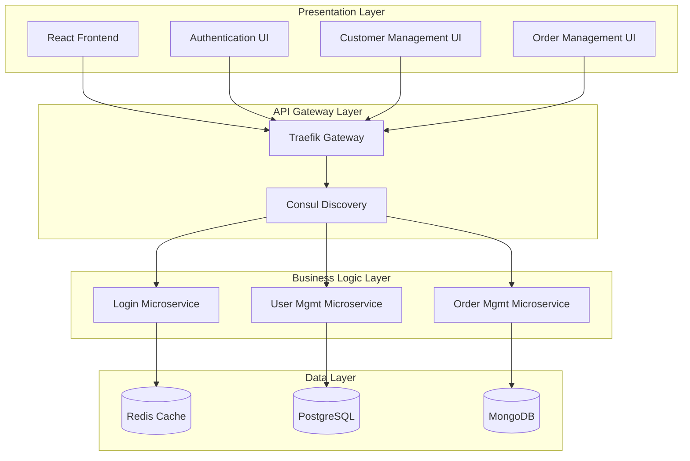
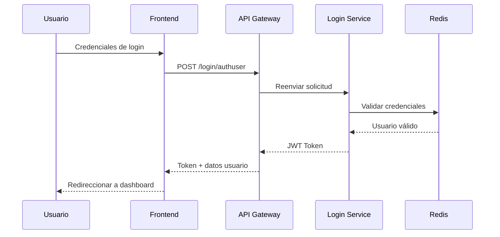
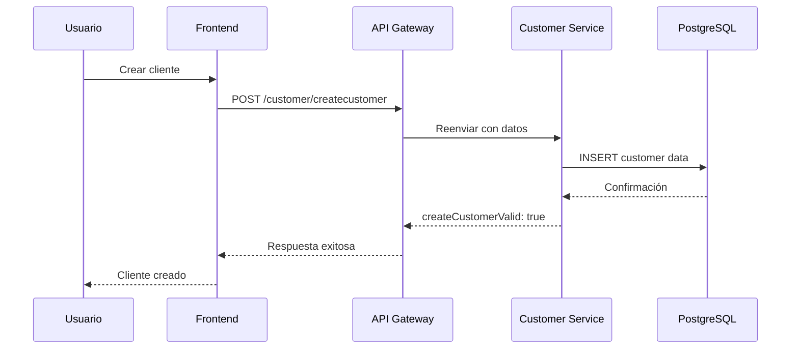
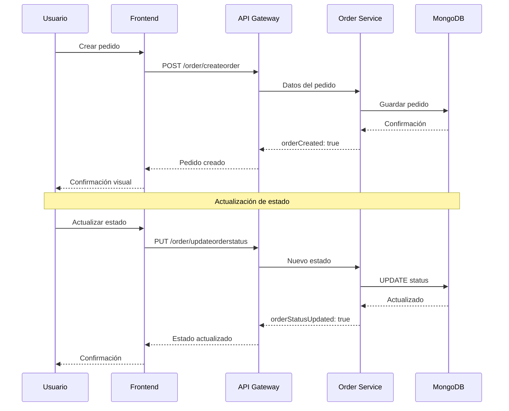
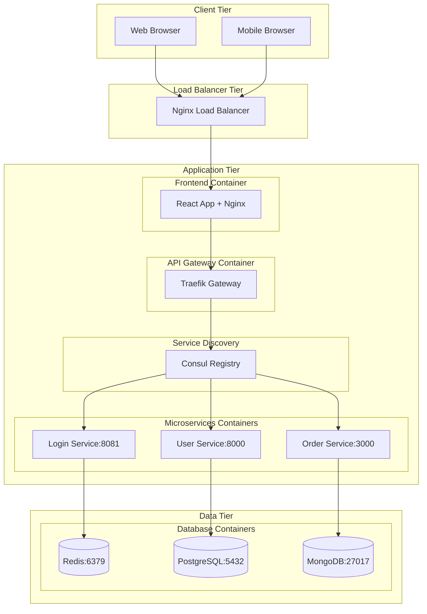

# Arquitectura 4+1 Vistas - Sistema de Gestión de Microservicios

**Modelo de Arquitectura de Philippe Kruchten**

## 📐 Vista Lógica (Logical View)

### Descripción
La vista lógica describe la funcionalidad que el sistema provee a los usuarios finales, enfocándose en los elementos funcionales y sus relaciones.

### Componentes Principales

#### 1. Capa de Presentación
- **Frontend React**: Interfaz de usuario responsiva
- **Componentes UI**: Sistema de componentes reutilizables
- **Gestión de Estado**: Manejo de autenticación y datos de aplicación

#### 2. Capa de Servicios
- **API Gateway (Traefik)**: Punto único de entrada
- **Service Registry (Consul)**: Descubrimiento de servicios
- **Microservicios**:
  - LoginMicroservice (Autenticación)
  - UserMgmtMicroservice (Gestión de Clientes)
  - OrderMgmtMicroservice (Gestión de Pedidos)

#### 3. Capa de Persistencia
- **PostgreSQL**: Datos relacionales (Clientes)
- **MongoDB**: Datos NoSQL (Pedidos)
- **Redis**: Cache y sesiones

### Diagramas UML - Vista Lógica

#### Diagrama de Componentes


#### Diagrama de Clases - Modelos de Datos
```mermaid
classDiagram
    class User {
        +String id
        +String username
        +String email
        +DateTime created_at
        +DateTime updated_at
    }
    
    class Customer {
        +String document
        +String firstname
        +String lastname
        +String address
        +String phone
        +String email
    }
    
    class Order {
        +String customerID
        +String orderID
        +OrderStatus status
        +DateTime created_at
    }
    
    class OrderStatus {
        <<enumeration>>
        Received
        InProgress
        Sent
    }
    
    Customer ||--o{ Order : "has many"
    Order ||--|| OrderStatus : "has status"
```

---

## 🏃‍♂️ Vista de Procesos (Process View)

### Descripción
La vista de procesos describe los aspectos dinámicos del sistema, mostrando la estructura de procesos y cómo se comunican.

### Flujos de Proceso Principales

#### 1. Proceso de Autenticación


#### 2. Proceso de Gestión de Clientes


#### 3. Proceso de Gestión de Pedidos


### Concurrencia y Sincronización
- **Stateless Services**: Todos los microservicios son stateless
- **Session Management**: Redis maneja las sesiones de usuario
- **Load Balancing**: Traefik distribuye carga automáticamente
- **Health Checks**: Monitoreo continuo de servicios

---

## 🏗️ Vista de Desarrollo (Development View)

### Descripción
La vista de desarrollo describe la organización estática del software en su ambiente de desarrollo.

### Estructura de Módulos

#### Organización del Código
```
Project-Software-Engineering/
├── frontend/                    # React + TypeScript
│   ├── src/
│   │   ├── components/         # Componentes reutilizables
│   │   ├── pages/             # Páginas de la aplicación
│   │   ├── types/             # Interfaces TypeScript
│   │   ├── utils/             # Utilidades y helpers
│   │   └── App.tsx            # Componente principal
│   ├── package.json           # Dependencias frontend
│   └── vite.config.ts         # Configuración build
├── login-service/              # Microservicio Go
│   ├── internal/
│   │   ├── handlers/          # Controladores HTTP
│   │   ├── models/            # Modelos de datos
│   │   ├── repository/        # Capa de datos
│   │   └── services/          # Lógica de negocio
│   ├── api/openapi.yaml       # Documentación API
│   └── main.go                # Punto de entrada
├── user-service/               # Microservicio Python
│   ├── app/
│   │   ├── api/               # Endpoints FastAPI
│   │   ├── models/            # Modelos SQLAlchemy
│   │   ├── schemas/           # Esquemas Pydantic
│   │   └── crud/              # Operaciones CRUD
│   ├── requirements.txt       # Dependencias Python
│   └── main.py                # Servidor FastAPI
├── order-service/              # Microservicio Node.js
│   ├── src/
│   │   ├── controllers/       # Controladores Express
│   │   ├── models/            # Modelos Mongoose
│   │   ├── routes/            # Definición de rutas
│   │   └── services/          # Servicios de negocio
│   ├── package.json           # Dependencias Node.js
│   └── server.ts              # Servidor Express
├── traefik/                    # Configuración API Gateway
│   ├── traefik.yml            # Config principal
│   └── dynamic.yml            # Rutas dinámicas
├── consul/                     # Configuración Service Discovery
│   └── consul.json            # Config Consul
└── docker-compose.yml         # Orquestación contenedores
```

#### Tecnologías por Módulo
| Módulo | Lenguaje | Framework | Base de Datos |
|--------|----------|-----------|---------------|
| Frontend | TypeScript | React + Vite | - |
| Login Service | Go | Gin | Redis |
| User Service | Python | FastAPI | PostgreSQL |
| Order Service | Node.js | Express | MongoDB |

#### Patrones de Desarrollo
- **DTO Pattern**: Implementado en todos los microservicios
- **Repository Pattern**: Separación de lógica de datos
- **Dependency Injection**: En servicios Python y Node.js
- **Clean Architecture**: Separación de capas bien definida

---

## 🏛️ Vista Física (Physical View)

### Descripción
La vista física describe el mapeo del software en el hardware y refleja aspectos de distribución.

### Arquitectura de Despliegue

#### Diagrama de Despliegue UML


### Configuración de Infraestructura

#### Contenedores Docker
```yaml
# docker-compose.yml principal
services:
  # Frontend Tier
  frontend:
    image: microservices-frontend
    ports: ["4200:80"]
    networks: [microservices-network]
    
  # API Gateway Tier  
  traefik:
    image: traefik:v3.0
    ports: ["8080:8080", "80:80"]
    volumes: ["/var/run/docker.sock:/var/run/docker.sock"]
    
  # Service Discovery
  consul:
    image: consul:1.14
    ports: ["8500:8500"]
    
  # Microservices Tier
  login-service:
    build: ./login-service
    ports: ["8081:8081"]
    depends_on: [redis, consul]
    
  user-service:
    build: ./user-service  
    ports: ["8000:8000"]
    depends_on: [postgres, consul]
    
  order-service:
    build: ./order-service
    ports: ["3000:3000"] 
    depends_on: [mongodb, consul]
    
  # Data Tier
  redis:
    image: redis:7-alpine
    ports: ["6379:6379"]
    
  postgres:
    image: postgres:15-alpine
    ports: ["5432:5432"]
    
  mongodb:
    image: mongo:7
    ports: ["27017:27017"]
```

#### Especificaciones de Hardware Recomendadas

| Componente | CPU | RAM | Almacenamiento | Red |
|------------|-----|-----|----------------|-----|
| Frontend Container | 0.5 vCPU | 512 MB | 100 MB | HTTP/HTTPS |
| API Gateway | 1 vCPU | 1 GB | 200 MB | HTTP/HTTPS |
| Microservices (c/u) | 1 vCPU | 1 GB | 500 MB | HTTP |
| Databases (c/u) | 2 vCPU | 2 GB | 10 GB | TCP |

### Red y Comunicación
- **Network**: `microservices-network` (Bridge driver)
- **Service Mesh**: Traefik + Consul service discovery
- **Load Balancing**: Round-robin por defecto
- **Health Checks**: Endpoint `/health` en todos los servicios
- **Security**: CORS configurado, headers de seguridad

---

## 🎭 Vista de Escenarios (Scenarios/Use Cases)

### Descripción
La vista de escenarios ilustra casos de uso específicos que validan y muestran la arquitectura.

### Casos de Uso Principales

#### CU-01: Autenticación de Usuario
**Actor**: Usuario del Sistema  
**Objetivo**: Acceder al sistema con credenciales válidas

**Flujo Principal**:
1. Usuario navega a `/login`
2. Ingresa username y password
3. Sistema valida credenciales contra Redis
4. Sistema genera JWT token
5. Usuario es redirigido a dashboard
6. Token se almacena para sesiones futuras

**Flujos Alternativos**:
- 3a. Credenciales inválidas → Mensaje de error
- 3b. Usuario no existe → Opción de registro

#### CU-02: Gestión de Clientes
**Actor**: Usuario Autenticado  
**Objetivo**: Crear y buscar clientes en el sistema

**Escenario - Crear Cliente**:
1. Usuario navega a `/customers`
2. Selecciona tab "Create Customer"
3. Completa formulario con datos requeridos
4. Sistema valida datos y almacena en PostgreSQL
5. Sistema confirma creación exitosa

**Escenario - Buscar Cliente**:
1. Usuario navega a `/customers`
2. Selecciona tab "Search Customer"
3. Ingresa document ID del cliente
4. Sistema consulta PostgreSQL
5. Sistema muestra datos del cliente encontrado

#### CU-03: Gestión de Pedidos
**Actor**: Usuario Autenticado  
**Objetivo**: Gestionar pedidos y sus estados

**Escenario - Crear Pedido**:
1. Usuario navega a `/orders`
2. Selecciona tab "Create Order"
3. Ingresa customerID y orderID
4. Sistema almacena pedido en MongoDB con estado "Received"
5. Sistema confirma creación

**Escenario - Actualizar Estado**:
1. Usuario selecciona tab "Update Status"
2. Ingresa orderID a actualizar
3. Selecciona nuevo estado (In Progress/Sent)
4. Sistema actualiza estado en MongoDB
5. Sistema confirma actualización

**Escenario - Buscar Pedidos**:
1. Usuario selecciona tab "Search Orders"
2. Ingresa customerID
3. Sistema consulta todos los pedidos del cliente
4. Sistema muestra lista de pedidos con estados

### Escenarios de Calidad

#### Escenario de Disponibilidad
- **Situación**: Un microservicio falla
- **Respuesta**: 
  - Consul detecta servicio no saludable
  - Traefik redirige tráfico a instancias saludables
  - Frontend muestra estado de servicio en dashboard
- **Medida**: Sistema mantiene 99.9% disponibilidad

#### Escenario de Performance
- **Situación**: 100 usuarios concurrentes
- **Respuesta**:
  - Redis maneja sesiones eficientemente
  - Conexiones de BD usando pooling
  - Respuestas API < 200ms promedio
- **Medida**: Tiempo de respuesta aceptable

#### Escenario de Seguridad
- **Situación**: Intento de acceso no autorizado
- **Respuesta**:
  - JWT tokens expiran automáticamente
  - API Gateway valida tokens en cada request
  - Headers de seguridad previenen ataques comunes
- **Medida**: Acceso denegado apropiadamente

---

## 📊 Matriz de Trazabilidad

| Requisito Funcional | Vista Lógica | Vista Procesos | Vista Desarrollo | Vista Física |
|---------------------|--------------|----------------|------------------|--------------|
| Login - Registrar Usuario | ✅ Componente Auth | ✅ Flujo Registro | ✅ LoginService | ✅ Container Login |
| Login - Autenticar | ✅ Componente Auth | ✅ Flujo Auth | ✅ LoginService | ✅ Container Login |
| Cliente - Crear | ✅ Customer UI | ✅ Flujo CRUD | ✅ UserService | ✅ Container User |
| Cliente - Buscar | ✅ Customer UI | ✅ Flujo Query | ✅ UserService | ✅ Container User |
| Pedido - Crear | ✅ Order UI | ✅ Flujo Create | ✅ OrderService | ✅ Container Order |
| Pedido - Actualizar | ✅ Order UI | ✅ Flujo Update | ✅ OrderService | ✅ Container Order |
| Pedido - Buscar | ✅ Order UI | ✅ Flujo Search | ✅ OrderService | ✅ Container Order |

---

*Esta documentación de arquitectura 4+1 vistas proporciona una comprensión completa del sistema desde múltiples perspectivas, asegurando que todos los stakeholders puedan entender y trabajar efectivamente con la arquitectura implementada.*